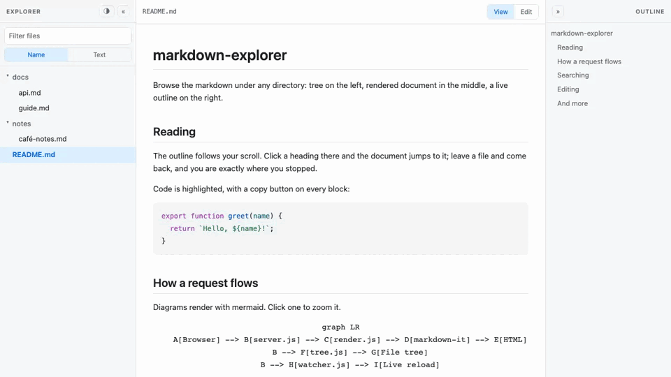

# markdown-explorer

[](https://www.npmjs.com/package/markdown-explorer)
[](https://github.com/luytbq/markdown-explorer/actions/workflows/ci.yml)
[](https://nodejs.org)
[](LICENSE)

Browse the markdown files under any directory, in your browser. Three panes: a file tree on the left, the rendered document in the middle, and a clickable heading outline on the right.

```bash
npx markdown-explorer
```

That serves the current directory and opens a tab. Nothing to configure.



## What you get

- A file tree of markdown only. Directories whose subtree contains no markdown are hidden, so you never click into a dead end.
- A filter box over the tree, on `/`. It matches loose letters anywhere along the path, so `dcgui` finds `docs/guide.md`, and it ignores accents, so `tailieu` finds `tài-liệu.md`. Clearing it puts the tree back exactly as you had it.
- The same box searches file contents, not just names: a Name / Text toggle switches it. Text mode lists the matching lines under each file, ignoring accents the same way, so `ca phe` finds a line that says `cà phê`. Clicking a hit opens the file on the section that holds it.
- Two modes for the document: read it, or edit it. Edit shows the file exactly as it sits on disk, frontmatter and HTML comments included, and saves it back. It opens on the section you were reading, with the cursor already there.
- Switching between files puts you back where you stopped reading, down to the pixel. If the file changed while you were away, you land on the heading you were on instead.
- Live reload. Save in your editor, the document updates, and you stay on the heading you were reading rather than being thrown back to the top.
- An outline that tracks your scroll position, including the last section of a document even when it is too short to fill the screen.
- Mermaid diagrams, syntax highlighting, tables, and GitHub-compatible heading anchors, including non-ASCII ones. A heading of `## Café Menu` gets the id `café-menu`, the same one GitHub would give it.
- A copy button on every code block and every diagram. The diagram copies its source, not the SVG it turned into.
- A lightbox on every image and diagram: click to fit it to the screen, click again for full size, panning by scroll. Images inside links stay links.
- Both side panes collapse to a rail, with `[` and `]`, or the chevron in each header. The way back stays on screen, and the choice is remembered.
- Dark mode, following your system preference until you override it.
- Shareable URLs. `?path=docs/guide.md#setup` restores the file and the scroll position.
- Links between markdown files open in the app instead of navigating away.
- File management from the tree's right-click menu: new file, new folder, rename, duplicate, and delete (behind a confirmation). Drag a file onto a directory to move it there. All of it is off under `--read-only`, which leaves only Pin/Unpin.

## Editing

The bar above the document has two modes. **Edit** replaces the rendered page with the raw file in a plain textarea: no preview, no rich text, no markdown swallowed. What you see is what is on disk, which is the point, because that is what you are about to write back.

`Ctrl+S` (`Cmd+S` on a Mac) saves. `e` opens the editor, `Escape` closes it. Saving writes through a temporary file and a rename, the same way vim and VS Code do, so a reader on another tab never catches the document half-written.

If the file changes on disk while you have it open, the editor says so rather than choosing for you. An untouched buffer just picks the new content up. A buffer with unsaved work in it is left exactly as you typed it, and you decide whether to keep yours or take theirs. Saving on top of a file that moved underneath you is a conflict, not a silent overwrite.

`--read-only` takes the editor away entirely and gives you back the viewer.

## Usage

```
mdv [directory] [options]

  --port <n>        port to listen on (default 4321, falls back if taken)
  --host <addr>     address to bind (default 127.0.0.1)
  --allow-host <h>  accept requests carrying this Host header (repeatable)
  --serve-all       serve every file under the root, not only images
  --read-only       browse only; disable saving from the editor
  --no-open         do not launch a browser
  -h, --help        show this
```

## Security

This is a web server that reads files out of whatever directory you point it at, so the defaults matter.

It binds to `127.0.0.1` and refuses any request whose `Host` header is not a loopback name. That second check is not decoration. Binding to loopback alone does not stop a page you visit from pointing its own hostname at `127.0.0.1` and reading the responses as same-origin, which is how local dev servers have historically leaked files. Use `--allow-host` if you genuinely need another name.

`/files/` serves images only. `--serve-all` opens it to every file under the root, which also means `.env` and `.git/config` become readable over HTTP. Turn it on when you know why you want it.

Every path from the browser is resolved and then checked for containment by path segment, after `realpath`, so neither `../` nor a symlink pointing outside the root will escape. Requests that try get a `403`, never a `404`, so the response cannot be used to probe for files outside the tree.

Saving is not the only write: creating, deleting, creating a folder, duplicating, renaming, and moving are writes too, and the `Host` check above protects none of them. Any page on the web can `PUT` or `POST` to `http://localhost:4321` with a Host header that is entirely legitimate; CORS stops it reading the answer, but the write would still land. So every write is refused unless its `Origin` is this server's own, and unless its content type is `application/json`, which forces a cross-origin caller into a preflight that is never answered. Every one resolves its path inside the root first, the file operations require a markdown extension, and a save refuses to create a file the way create refuses to overwrite one. `--read-only` turns all of them off, and the tree's menu falls back to Pin/Unpin, which never touch the server.

Rendered HTML is not sanitised. The server renders files you already own on a machine you already control, and `html: true` is what makes real documents render correctly. Do not point this at a directory of markdown you did not write and then expose it to a network.

## Requirements

Node 20 or newer. Linux, macOS and Windows.

## Development

```bash
npm install
npm test              # unit and server tests, no browser needed
npx playwright test   # browser tests: scrollspy, live reload, mermaid
```

Mermaid is vendored as a single self-contained 3.4 MB file under `public/vendor/`, rather than taken as a dependency. Depending on it would pull 111 packages and 154 MB onto every user of a CLI that needs exactly one browser bundle. To update it:

```bash
npm run vendor:mermaid          # latest
npm run vendor:mermaid 11.16.0  # a specific version
```

The script refuses to vendor a build that contains a dynamic `import()`, since that would mean the bundle is no longer self-contained.

## License

MIT. Bundled mermaid is MIT too; its license travels with it in `public/vendor/mermaid.LICENSE`.
